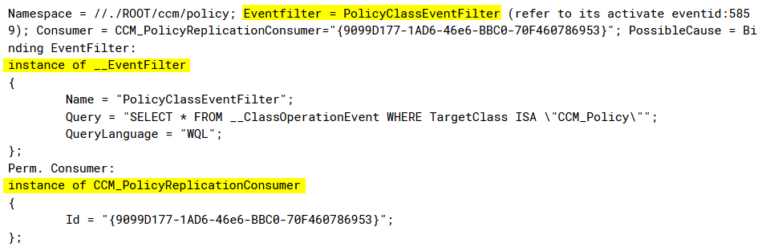

# Event Triggered Execution: Windows Management Instrumentation Event Subscription (T1546.003)


### Goal
Detect  Windows Management Instrumentation (WMI) event subscription if WMI installs event filters, consumers, and bindings that execute malicious content when a defined event occurs to establish persistence and elevate privileges.

---

### Categorization
This activity is categorized by MITRE as:
* **ID:** T1546.003
* **Tactic:** Privilege escalation, persistence
* **Technique:** Event Triggered Execution  
* **Subtechnique:** Windows Management Instrumentation Event Subscription
 
---

### Strategy Abstract
The strategy will function as follows:
* Monitor WMI activity via sysmon on Windows systems (e.g.   filter, consumer or binding creation).

* Look for an unusual/suspicious action that is executed when a specific condition is met.

* Suppress any known event subscription.

* Alert on any unusual event subscription.

---

### Technical Context
#### Description from ATT&CK 
Adversaries may establish persistence and elevate privileges by executing malicious content triggered by a Windows Management Instrumentation (WMI) event subscription. WMI can be used to install event filters, providers, consumers, and bindings that execute code when a defined event occurs. Examples of events that may be subscribed to are the wall clock time, user loging, or the computer's uptime.
Adversaries may use the capabilities of WMI to subscribe to an event and execute arbitrary code when that event occurs, providing persistence on a system. Adversaries may also compile WMI scripts into Windows Management Object (MOF) files (.mof extension) that can be used to create a malicious subscription.
WMI subscription execution is proxied by the WMI Provider Host process (WmiPrvSe.exe) and thus may result in elevated SYSTEM privileges.

##### **What is WMI?**  

WMI is the Microsoft implementation of Web-Based Enterprise Management (WBEM), a collection of technologies used to manage information and systems in enterprise environments. WMI is a built-in feature of Windows endpoints that allows  to interact and manage many different functions of the operating system such as network interfaces, power settings, service status, and installed software or patches can all be queried and managed via WMI.

##### **What is WMI Event Subscription?** 
A WMI Event Subscription can trigger an action when a certain condition is met, and it consists of three components:

* **EventFilter:** Specifies a condition that you test for, i.e. a user successfully authenticates, a particular time and day of the week occurs, etc.
* **EventConsumer:** Specifies an action to execute when the EventFilter condition is met, i.e. execute a Windows command or script, delete all Volume Shadow Copies, restart a service, etc.
* **FilterToConsumerBinding:** This links an EventFilter to an EventConsumer instance.

##### **More about WMI**  
Most functionality stored in default namespace (library of object classes) called *“Root\\CIMv2”*. The CIMv2 classes include: Hardware, installed applications, operating system functions, performance and monitoring and WMI management.

MOF files:

Managed object format (MOF) is the language used to describe CIM (Common Information Model) classes. A MOF file typically contains statements, classes and class instances which are added to the WMI repository (OBJECTS.DATA) when the file is compiled (mofcomp.exe can compile MOF files and it is part of Windows).

Persistent WMI objects are stored in the WMI repository:
* %SystemRoot%\System32\wbem\repository\OBJECTS.DATA

WMI settings:
* HKEY_LOCAL_MACHINE\SOFTWARE\Microsoft\WBEM
* Win32_WmiSetting class

Utilities:
* wmic.exe
* winrm.exe
* wbemtest.exe


##### **Attacker perspective**  
WMI can be used to perform several activities such as lateral movement, persistence, situational awareness, code execution and as a command and control (C2). WMI events run as a SYSTEM, persists across reboots and Administrator level privileges are required to use this technique.

An attacker can “live off the land” by abusing built-in features of the operating system, which often results in a lower risk of detection than if they introduced malware into a victim environment.

---

### Blind Spots and Assumptions
This strategy relies on the following assumptions:

* Sysmon is running and functioning correctly on the endpoints.
* WMI activity are being recorded (Event ID 19,20,21,5861,1).  
* Windows and Sysmon are correctly forwarding logs to HELK or ElasticSecurity.
* HELK/ElasticSecurity is successfully indexing Windows and Sysmon logs.  

A blind spot will occur if any of the assumptions are violated. 

* HELK/ElasticSecurity cannot indexing logs.
* Endpoint isn´t forwarding logs to HELK/ElasticSecurity.
* Sysmon is modified to not collect WMI activity.

---

### False Positives

In many cases, the following event appear:

**Event 5861**



In Configuration Manager, the *CCM_Policy_EmbeddedObject* class is a client Windows Management Instrumentation (WMI) class that represents a policy setting embedded object. Use of embedded objects ensures that the class definition is correctly replicated throughout the policy tree. 


---

### Priority
The priority is set to medium under  this conditions:

* Attackers require Administrator or SYSTEM permissions to use this technique
* Many organizations are incapable of monitoring or investigating WMI
* WMI visibility is limited, and a third-party utility may be required to effectively convey how WMI is being used
* WMI is an integral component of Windows


---

### Validation
Validation can occur for this ADS by performing the following execution on HELK:  

```text
(event_id : 19 and task : "WmiEventFilter activity detected") or (event_id : 20 and task: "WmiEventConsumer activity detected") or (event_id : 21 and task : "WmiEventConsumerToFilter activity detected") or (event_id : 5861 and not CONSUMER : "NTEventLogEventConsumer")
```

---

### Response
In the event that this alert fires, the following response procedures are recommended: 

* Verify event ID 5861. With this event ID we can see filter and consumer. If we can see more detail about filter and consumer, we can check event ID 19 y 20.

* Identify unusual/suspicious action that is executed when a specific condition is met

* Search by process GUID to see all the activity or by other related indicators to reconstruct the chain of events. 

* Suppress any known event subscription 


---

### Additional Resources

* https://attack.mitre.org/techniques/T1546/003/
* https://www.elastic.co/es/blog/hunting-for-persistence-using-elastic-security-part-1

