# D.E.A.T.H. Prework

## Threat Hunting
Threat hunting se refiere a cualquier método manual o semiautomático que permite identificar de forma proactiva la presencia de agentes amenaza en un ambiente tecnológico, asumiendo que estos han evadido los controles de detección existentes.

El objetivo principal del Threat hunting es reducir el tiempo de detección y respuesta al identificar compromisos antes de que una  amenaza sea capaz de completar sus objetivos.

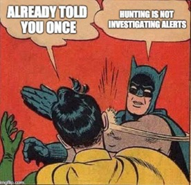

### Defensa Continua

Threat Hunting requiere un cambio de pensamiento en donde no solo basta con prevenir que un compromiso ocurra y responder a él, sino que es necesario detectarlo activamente. Se busca pasar de un enfoque meramente preventivo localizado en las fases de descubrimiento, trega, y explotación a las fases "post-mortem".

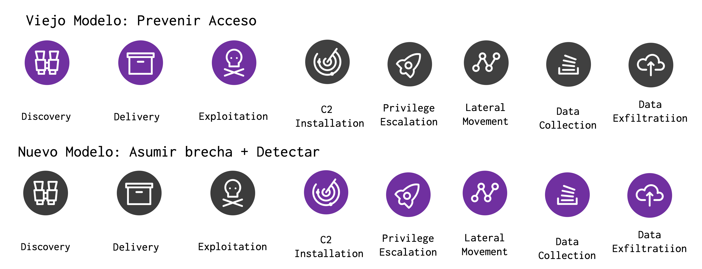{: width="50%"}

¿Dónde se ubica Threat Hunting en el marco de defensa continua?

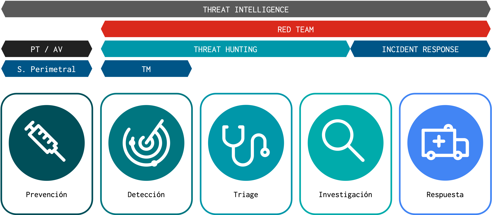{: width="50%"}

#### Detección
- Esta fase se basa en el análisis de datos centralizados para hacer detecciones a nivel organización.
- Se busca detecta comportamientos anómalos y/o maliciosos. 
    - Por ejemplo, procesos accediendo a la memoria de `lsass.exe` vs.
    - Detección del uso de la herramienta `mimikatz` (débil).
- Generación de hipótesis → análisis → validación → conclusión.
- Reduce “paja” en los datos recolectados y produce alertas de alta fidelidad para ser utilizados en las siguientes fases.

> **LECTURA ADICIONAL:**
> [Introducing the Funnel of Fidelity](https://posts.specterops.io/introducing-the-funnel-of-fidelity-b1bb59b04036)

#### Triage
- ¿Es malicioso o benigno?
- En esta fase se utilizan alertas generadas en las fases anteriores.
- Se hace uso de fuentes de datos adicionales.
    - Internos y Externos.
- Se busca llegar a una conclusión:
    - Benigno → Falso positivo, se debe afinar la detección.
    - Sospechoso → Se pasa a la fase de investigación.
    - Malicioso → Se pasa directamente a la fase de respuesta.

#### Investigación
- Existen datos que no son aptos para ser centralizados:
    - Memoria 
    - Tráfico de Red
    - Sistema de archivos (disco) 
- Se debe identificar el contexto del posible incidente.
- Se analizan las evidencias recolectadas.
- Se determina si el evento se trata de un incidente o un falso positivo.

### Threat Hunting Frameworks
Un Framework de Threat Hunting es un sistema de procesos repetibles diseñados para que tus esfuerzos sean más confiables y eficientes. Estos permiten entender:

- ¿Qué tipos de "Hunt" existen?
- ¿Cómo realizar cada tipo de Hunt?
- ¿Qué tipo de salidas puede haber?
- ¿Cómo medir el éxito de un Hunt?

En escencia, un marco de trabajo **provee procesos repetibles y mejora la eficiencia de las operaciones y la calidad de los resultados.** Algunos frameworks utiles pueden ser:

- [Sqrrl Threat Hunting Reference Model](https://www.threathunting.net/files/framework-for-threat-hunting-whitepaper.pdf)
- [TaHiTi (Targeted Hunting integrating Threat Intelligence)](https://www.betaalvereniging.nl/wp-content/uploads/TaHiTI-Threat-Hunting-Methodology-whitepaper.pdf)
- [Splunk PEAK](https://www.splunk.com/en_us/blog/security/peak-threat-hunting-framework.html)

> **CONCEPTO** 
> [Threat Informed Defense](https://medium.com/mitre-engenuity/accelerating-threat-informed-defense-a-collaborative-approach-3a3104f5fe5c): *"The systematic application of a Deep understanding of adversary tradecraft and technology to prevent, detect and/or repond to cyber attacks"*

{: width="30%"}

### Puntos clave
- Threat Hunting no es investigación de alertas, sino un enfoque proactivo de investigación aplicable a las fases "post-mortem" de un kill chain. 
- Sus distintas fases permiten el análisis metodológico de datos con elf in de identificar actividad maliciosa antes de que la amenaza logre los objetivos en el ambiente tecnológico.
- El uso de marcos de trabajo permite establecer procesos estructurados, medibles, y escalables para la implementación y gestión de procesos de Threat Hunting (así como su interacción con otras disciplicas defensivas y ofensivas).

## Ingeniería de detección

### Threat Hunting vs Detection Engineering
Threat Hunting es una práctica proactiva e iterativa que, a través de redes, endpoints y conjuntos de datos, busca detectar y aislar amenazas avanzadas que han evadido los controles de seguridad preventivos. Hace uso de una variedad de técnicas, incluyendo análisis de comportamiento, machine learning y análisis de datos para identificar patrones y anomalías que pueden indicar una potencial amenaza.

Ingeniería de detección es el proceso responsable de diseñar, implementar y mantener sistemas de detección que puedan identificar y alertar a los equipos de seguridad sobre potenciales amenazas. Trabajan de cerca con los equipos de detección y respuesta para asegurar que estos sistemas sean efectivos en identificar estas amenazas. Hace uso de una variedad de herramientas y técnicas, incluyendo análisis de datos y análisis de comportamiento para crear analíticos.

A menudo, el blue team construye detecciones basadas en indicadores frágiles:
- Valores Hash.
- Direcciones IP. 
- Nombres de dominio.
- Parámetros de línea de comandos.

Desafortunadamente, este enfoque es fácilmente evadido por los atacantes, ya que estos indicadores pueden cambiar tan fácil como el cambio de un byte.

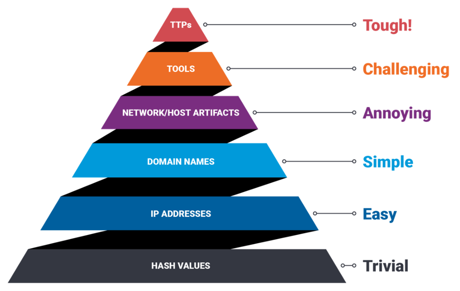{: width="50%"}

[La pirámide del dolor de David Bianco](https://www.attackiq.com/glossary/pyramid-of-pain/) es una representación de indicadores de compromiso (IOC) ordenados por su importancia para un adversario. Bloquear estos IOCs puede ser doloroso en mayor o menor medida para el adversario con base en la dificultad que estos representan.

El equipo encargado de la detección debe cambiar su enfoque si quiere combatir a atacantes pensantes (human vs human), y cada día más provistos de herramientas que aceleran el desarrollo de vectores de ataque complejos.

Para ello, un proceso repetible puede ayudar al equipo de Threat Hunting a crear detecciones más robustas.

### Clasificación de Detecciones 
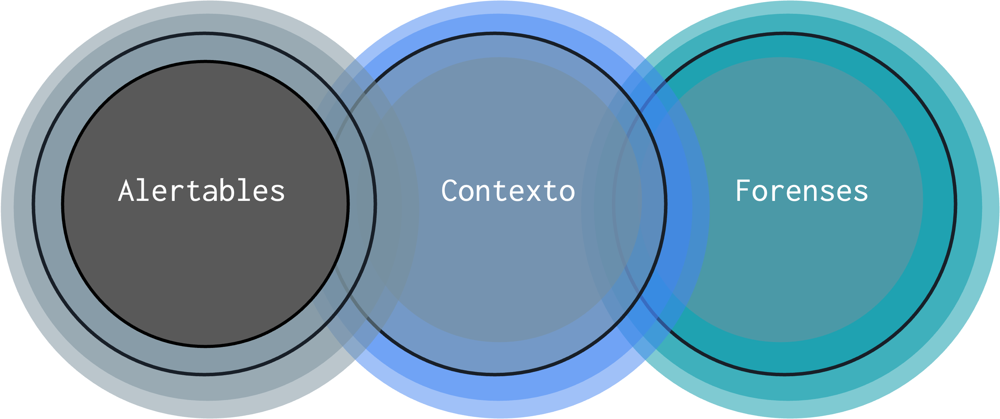{: width="50%"}

#### Alertables
- Detección de comportamiento que no es malicioso, pero sí inusual y hasta sospechoso.
- Igual que las detecciones de conciencia situacional, este tipo de detecciones no necesariamente indican un ataque.
 
**Ejemplos:** 
- Nuevos procesos. 
- Valor atípico de procesos padre de `cmd.exe` o `powershell.exe`.
- Borrado de logs de eventos. 

#### Contexto
- Analíticos enfocados a obtener un entendimiento general de lo que está ocurriendo dentro del ambiente tecnológico, en un momento determinado. 
- Las veces que un usuario inicia sesión o procesos ejecutándose podrían no indicar actividad maliciosa por sí mismos, pero correlacionados con otros indicadores pueden proveer datos adicionales.

**Ejemplos:**
- Procesos ejecutándose (e.g. Software de seguridad).
- Login de usuarios en dominio.  

#### Forenses
- Este tipo de detecciones son más útiles cuando se está realizando una investigación relacionada a un evento. Muchas veces, una detección forense requiere algún tipo de entrada para ser más útil.

**Ejemplos:**
- Determinar si un Credential Dumper fue ejecutado para comprometer cuentas. 
- Inicio de sesión remoto desde o hacia un sistema, en un periodo de tiempo particular

### Detecciones Mitre ATT&CK EDR Evaluations
MITRE ATT&CK Enterprise Evaluation es un marco para evaluar la eficacia de diferentes soluciones de ciberseguridad a la hora de detectar y prevenir amenazas del mundo real. Implica simular varios escenarios de ciberataques y evaluar la eficacia con la que las diferentes soluciones de seguridad pueden detectarlos y responder a ellos.

Los proveedores pueden participar en la evaluación enviando sus soluciones a MITRE para que las pruebe. Los resultados de la evaluación se publican en un informe que permite a los clientes comparar la eficacia de las distintas soluciones de seguridad para detectar y responder a los ataques.

#### Categorías de detección
- La evaluación se centra en cómo se producen las detecciones, no en asignar puntuaciones a los proveedores.
- Las detecciones se organizan según cada subpaso (es decir, la implementación de una técnica).
- Se requieren pruebas/evidencias para cada detección.
- Los proveedores pueden detectar procedimientos de formas que no se habían registrado.
- Cada subpaso tiene una única categoría de detección que representa el nivel más alto de contexto proporcionado al analista en todas las detecciones para ese subpaso.
- Las detecciones que requieren modificadores se separarán para permitir filtrar.
- Las categorías se calibran en todos los proveedores para garantizar la coherencia.
- El análisis humano está sujeto a discreción y sesgos, pero se realizan esfuerzos para protegerse contra estos sesgos.

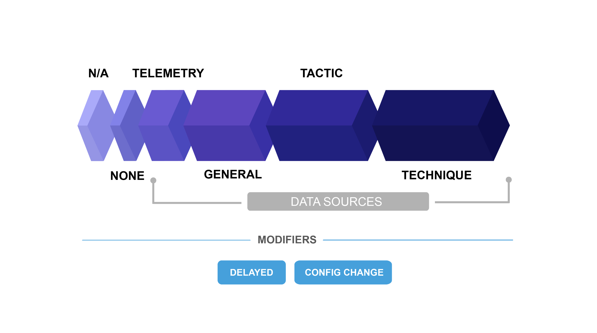{: width="70%"}

**N/A (no aplicable)**
El proveedor no tiene visibilidad del sistema, por ejemplo, no hay ningún agente implementado en la máquina.

**None**
No se produce ninguna detección.

**Telemetry**
Datos mínimos sin detecciones.

**General**
Detección maliciosa pero sin contexto, por ejemplo, una detección de "archivo sospechoso" activada tras la ejecución inicial del archivo ejecutable.

**Tactic**
Detectar actividad maliciosa correlacionada con la táctica del ATT&CK.

**Technique**
Detectar actividad maliciosa correlacionada con la técnica ATT&CK, así como con la subtécnica.

> **;TLDR**
> *Si las soluciones de los proveedores detectan una técnica de ataque significa que tienen la cobertura más completa para investigar el ataque.*

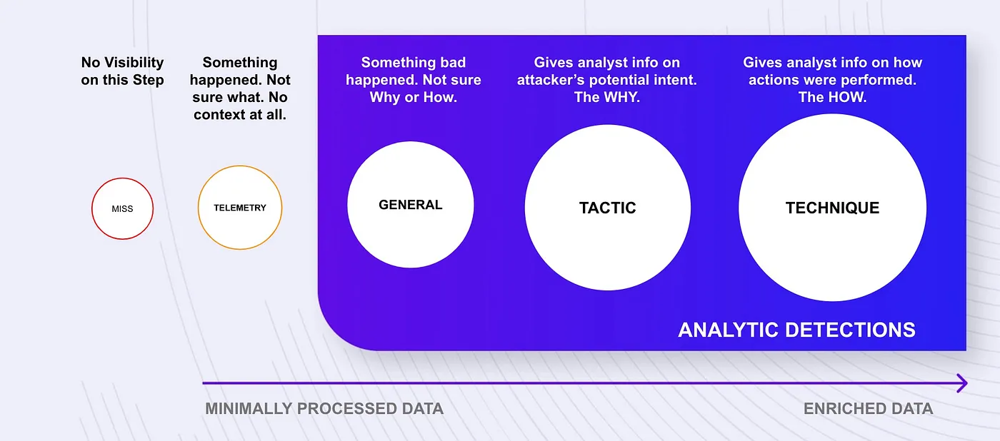{: width="70%"}

### Puntos clave
- La detección de una técnica está en función de la calidad de los datos y el analítico que los analiza. 
- Por lo tanto, es necesario contar con los datos necesarios y una metodología que genere detecciones de alta calidad.
- Esta metodología debe ser probada, mejorable y repetible.

## Metodología de Ingeniería de Detección - Walkthrough

1. Seleccionar una técnica objetivo.
2. Investigar la tecnología asociada.
3. Crear una prueba de concepto. 
4. Identificar las fuentes de datos.
5. Construir la detección.

### Seleccionar una técnica objetivo.
- Selecciona la técnica que será el objetivo de la detección.
- Las detecciones deben construirse al nivel más genérico posible, pero muchas veces una técnica requiere de múltiples detecciones para estar cubierta.

| Entrada | Salida |
| --- | --- |
| Mitre ATT&CK. | Una técnica específica que será el objetivo. |
| Fuentes de datos de la organización. | Posiblemente, una implementación específica de la técnica (procedimiento). |
| Threat Intelligence. | |

Se pueden adoptar más de un criterio para seleccionar las técnicas:
- Data Driven
- Intel Driven
- Entity Driven
- TTP Driven
- Research Driven

Para nuestro ejemplo práctico deleccionaremos [T1569.002 - System Services: Service Execution](https://attack.mitre.org/techniques/T1569/002/)

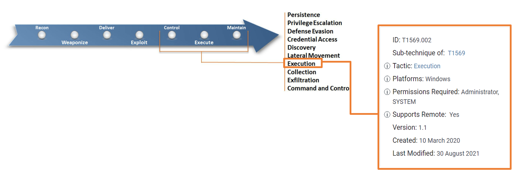{: width="70%"}

### Investigar la tecnología asociada.
- Investigar la tecnología asociada con esa técnica ayuda a comprender los casos de uso, fuentes de datos relacionadas y oportunidades de detección.
- Los Detection Engineers a veces crean detecciones genéricas, debido a la falta de entendimiento de la tecnología asociada.

| Entrada | Salida |
| --- | --- |
| Técnica seleccionada. | ¿Cómo funciona la técnica (bajo nivel)? |
| Mitre ATT&CK. | ¿Qué atacantes podrían usar esta técnica? |
| | ¿Qué alternativas a este ataque tienen los atacantes? |
| | Lista potencial de fuentes de datos. |

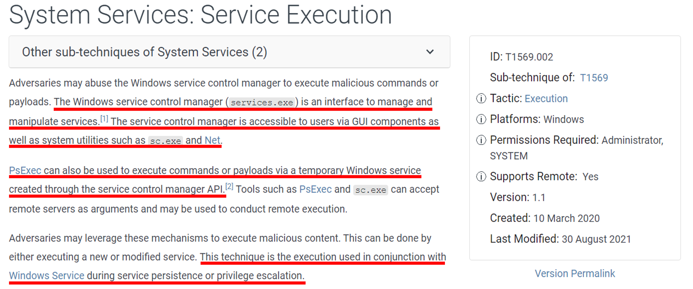{: width="70%"}

#### Siguiendo al conejo blanco - Preguntas iniciales y abtracción
Haciendo uso de [Capability Abstraction](https://posts.specterops.io/capability-abstraction-fbeaeeb26384) podemos tener un entendimiento cada vez más profundo de nuestro objeto de estudio, por ejemplo, SpecterOps usa el ejemplo de [Kerberoasting](https://attack.mitre.org/techniques/T1558/003/):

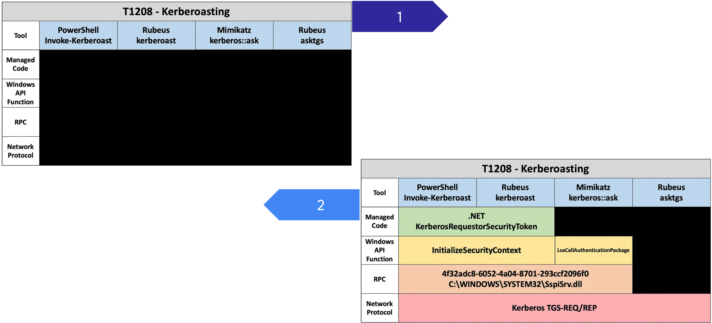{: width="70%"}

Regresando a nuestro ejemplo práctico, podemos plantearnos una serie de preguntas iniciales que nos ayuden a entender "how deep the rabbit hole goes"

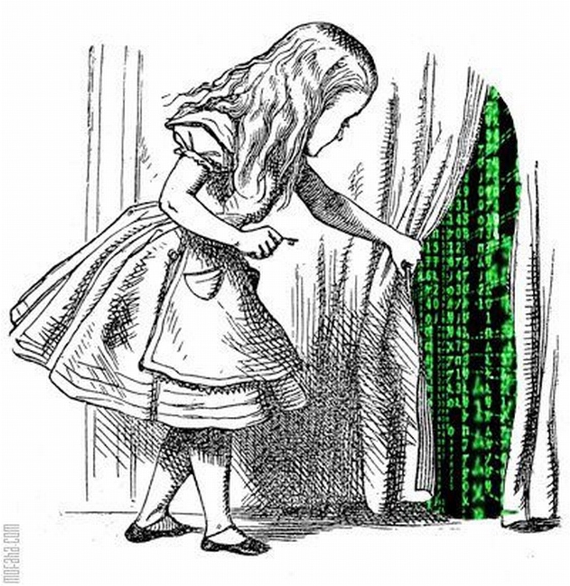{: width="30%"}

- ¿Qué hay acerca de Service Control Manager que Windows Services necesita para funcionar?
- ¿Qué utilidades del sistema están disponibles para manipular servicios?
- ¿Es `PsExec` la única alternativa adicional para lograr ejecución mediante servicios?

##### Relación de procesos
Para responder la primer pregunta, comenzamos por analizar cómo funcionan los servicios en Windows. 

[Service Control Manager](https://learn.microsoft.com/en-us/windows/win32/services/service-control-manager) (`services.exe`) o SCM es el proceso del sistema que se ejecuta desde su imagen `services.exe` ubicada en `System32` y es [considerado el proceso padre de todos los servicios](https://learn.microsoft.com/en-us/dotnet/framework/windows-services/introduction-to-windows-service-applications). Es responsable de ejecutar y manejar los servicios en el sistema.

Mantiene el estado de todos los servicios instalados mediante una llave en el registro llamada SCM Database localizada en la siguiente ruta: `HKEY_LOCAL_MACHINE\SYSTEM\CurrentControlSet\Services`

Cuando SCM se inicia, lanza todos los servicios que están marcados como “auto-start” y todas las dependencias necesarias para ejecutarlos.

Todos estos servicios y otros serán creados como “procesos hijo” de `services.exe`. Si se observa el árbol de procesos de `services.exe` se identifican dos tipos de procesos: 

- Multiples instancias de `svchost.exe`
- Procesos que contienen sus propios servicios

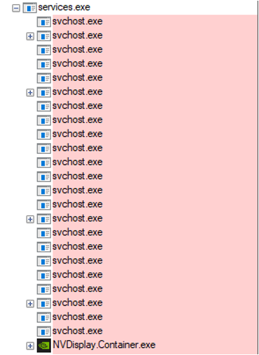{: width="20%"}
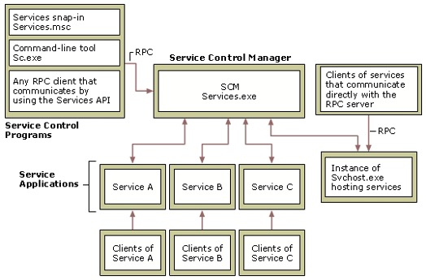{: width="40%"}

> **Respuesta:**
> **¿Qué hay acerca de Service Control Manager que Windows Services necesita para funcionar?**
> - Ejecuta y gestiona todos los servicios del sistema, su proceso es `services.exe`

##### Creación de servicios
Para responder la siguiente pregunta, analicemos la creación de servicios.

La creación y/o modificación de servicios puede lograrse de distintas maneras empleando diferentes componentes de Windows:
- `sc.exe`
- `powershell.exe`
- `WMI`
- Win32 API

**`sc.exe`** crea una subllave y entradas para un servicio en el registro de Windows y en la base de datos de Service Control Manager
Ejemplos:
```powershell
sc.exe \\myserver create NewService binpath= c:\windows\system32\NewServ.exe
sc.exe create NewService binpath= c:\windows\system32\NewServ.exe type= share start= auto depend= +TDI NetBIOS
```
**En PowerShell**, el cmdlet `New-Service` crea una nueva entrada en el registro y en la base de datos de servicios. Un nuevo servicio requiere un archivo ejecutable que corra mientras está en funcionamiento.

Los parámetros de este cmdlet permiten definir el nombre que se mostrará, descripción, tipo de inicio y dependencias

Ejemplos:
```powershell
New-Service -Name "TestService" -BinaryPathName '"C:\WINDOWS\System32\svchost.exe -k netsvcs"'
```

En el caso de **WMI**, el método `Create` crea un nuevo servicio en el sistema.
Ejemplos:
```powershell
uint32 Create(
  [in] string  Name,
  [in] string  DisplayName,
  [in] string  PathName,
  [in] uint8   ServiceType,
  [in] uint8   ErrorControl,
  [in] string  StartMode,
  [in] boolean DesktopInteract,
  [in] string  StartName,
  [in] string  StartPassword,
  [in] string  LoadOrderGroup,
  [in] string  LoadOrderGroupDependencies[],
  [in] string  ServiceDependencies[]
);
```

Al hablar de creación de servicios, hablamos de creación de procesos. **La API de Windows** proveé varias funciones para crear procesos. La más simple es `CreateProcess`, la cual intenta crear un proceso con el mismo token de acceso que el proceso que la invocó. Si un token diferente es requerido, puede emplearse `CreateProcessAsUser`.

Otras funciones disponibles incluyen `CreateProcessWithTokenW` y `CreateProcessWithLogonW` (ambas parte de `advapi32.dll`). `CreateProcessWithTokenW` es similar a `CreateProcessAsUser`, la diferencia radica en los privilegios requeridos por la entidad que hace la llamada. `CreateProcessWithLogonW` es un atajo muy útil para hacer “log on” con credenciales de usuario y crear un proceso con el token resultante, todo esto en una sola acción.

**Creación de un servicio**

- Las funciones de creación de procesos contenidas en `Advapi32.dll` llaman al servicio secundario de inicio de session (`seclogon.dll`, incluido en un `SvcHost.exe`) al hacer un Remote Procedure Call (RPC) para realizar la creación del proceso.

- SecLogon ejecuta la llamada en su función interna `SlrCreateProcessWithLogon`, si no hay errores, posteriormente ejecuta la función `CreateProcessAsUser`.

- El servicio SecLogon está configurado por defecto para iniciar de manera manual, por lo tanto, la primera vez que las funciones `CreateProcessWithTokenW` o `CreateProcessWithLogonW` son llamadas, el servicio es iniciado. Si el servicio falla al iniciar (un administrador puede configurar el servicio como deshabilitado), estas llamadas a función fallaran.

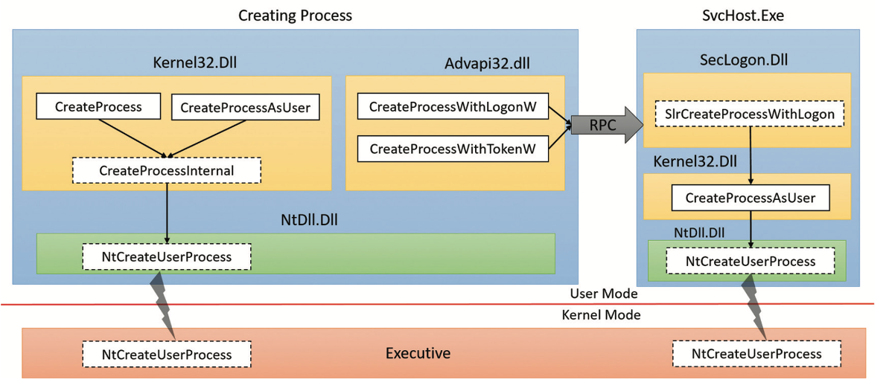{: width="50%"}

¿Ya es todo? ¿Qué sigue? ¿Análisis estático? ¿Dinámico?

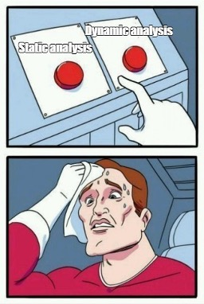{: width="30%"}

El análisis no termina aquí. Podemos hacer uso de [Sysinternals](https://learn.microsoft.com/en-us/sysinternals/) para continuar nuestro entendimiento:
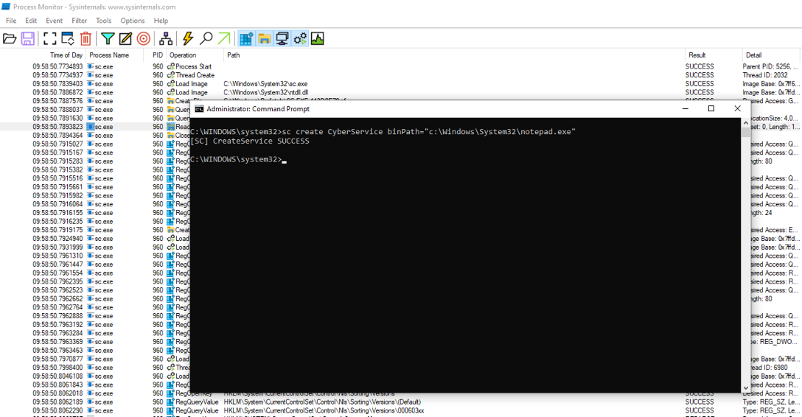{: width="70%"}
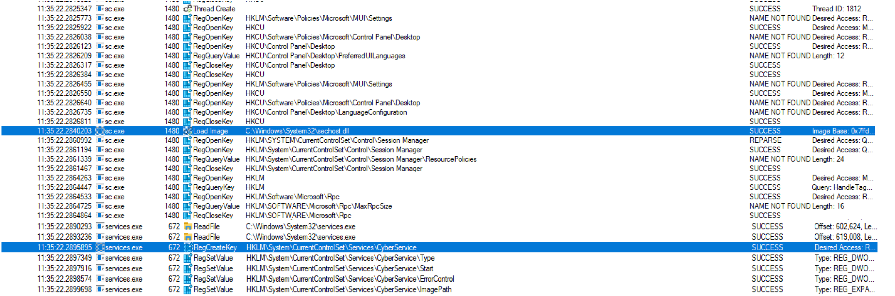{: width="70%"}

¿Qué pasa en el registro de Windows?
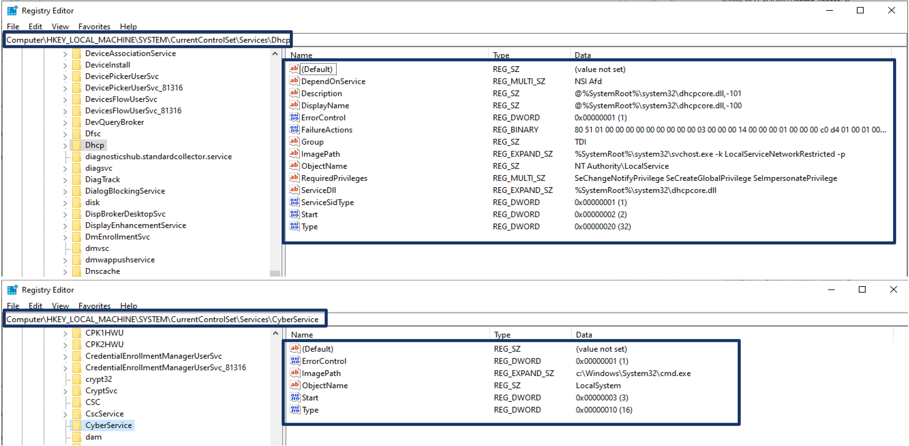{: width="70%"}

- Cuando un programa de control de servicio (SCP), registra un servicio al llamar a la función Create Service, una llamada a la instancia SCM (Service Control Manager) ejecutándose en el sistema es realizada. 

- SCM entonces crea una llave de registro para el servicio bajo la llave `HKLM\SYSTEM\CurrentControlSet\Services`

- La llave `Services` es la representación no volátil de la base de datos. Las llaves individuales de cada servicio definen la ruta del ejecutable que contiene el servicio, así también como los parámetros y opciones de configuración.

> **Respuesta:**
> **¿Qué utilidades del sistema están disponibles para manipular servicios?**
> - SC, Powershell, WMI y API WIN32

##### Shared Library
Con base en nuestra investigación de creación de servicios, ahora nos surge una nueva pregunta:

- ¿Qué biblioteca provee la función `CreateService` la cual es necesaria para crear un servicio?

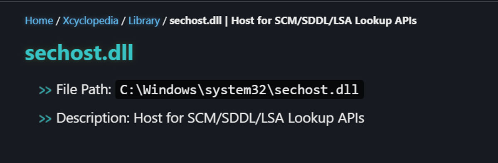{: width="50%"}
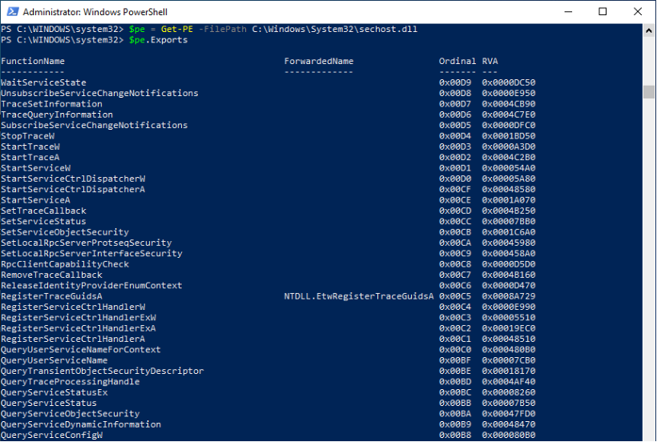{: width="50%"}
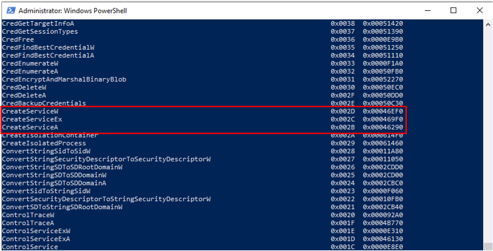{: width="50%"}

> **Respuesta:**
> **¿Qué biblioteca provee la función `CreateService` la cual es necesaria para crear un servicio?**
> - `sechost.dll`

Con base en esta investigación podemos también responder la última pregunta que nos planteamos al inicio. Como podemos ver, a partir de la selección de una técnica podemos abstraer sus distintos componentes y generar una serie de preguntas iniciales que guían nuestra investigación. De la misma, nuevas preguntas pueden surgir que van enriqueciendo aún más la investigación y por tanto, el entendimiento de la técnica.

### Crear una prueba de concepto. 
Busca o crea una prueba de concepto que permita evaluar las fuentes de datos y validar sus detecciones.

| Entrada | Salida |
| --- | --- |
| Técnica/procedimiento objetivo. | Habilidad para ejecutar la técnica con propósitos de validación. |
| Entendimiento de la técnica o sub técnica | Parámetros de línea de comandos. |
| | Script |
| | Binario |

Podemos hacer uso de diversas funtes para la creación de nuestra prueba de concepto, como el mismo Mitre o los [Atomic Tests de Red Canary](https://redcanary.com/atomic-red-team/).

```powershell
sc.exe \\myserver create NewService binpath= c:\windows\system32\NewServ.exe
psexec.exe -accepteula -d -s \\<INTERNAL_IP> rundll32.exe C:\windows\192145.dll,StartW
```

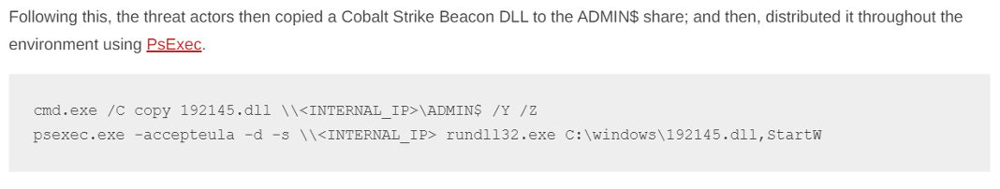{: width="70%"}

### Identificar las fuentes de datos.
- Evaluar qué fuentes de datos son necesarias para permitir la detección de la técnica.

| Entrada | Salida |
| --- | --- |
| Técnica/procedimiento seleccionado. | Lista de fuentes de datos seleccionadas. |
| Entendimiento de la tecnología involucrada. | Fuentes de datos necesarias habilitadas y centralizadas. |
| Entendimiento de la motivación del atacante. |  |
| Prueba de concepto. |  |

#### ¿Qué son? 
Las fuentes de datos proveen una manera de crear relaciones entre las actividades de adversarios y la telemtria recolectada en un ambiente tecnologico. Esto convierte a las fuentes de datos en uno de las aspectos más vitales para desarrollar detecciones.

El proyecto de Mitre ATT&CK ha trabajado por años para poder brindar una estructura y metodologia para describir fuentes de datos que permitan una mejor comprensión y accionabilidad de las mismas, este avance ha sido reflejado desde la versión 9.0 (2021)

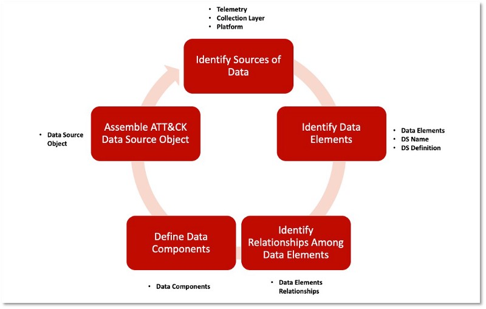{: width="70%"}

> **LECTURA ADICIONAL:**
> [Mitre ATT&CK Data Sources](https://github.com/mitre-attack/attack-datasources?tab=readme-ov-file)


Podemos hacer uso de [Mitre data sources](https://github.com/mitre-attack/attack-datasources) para llevar a cabo el modelado de datos; similar a:

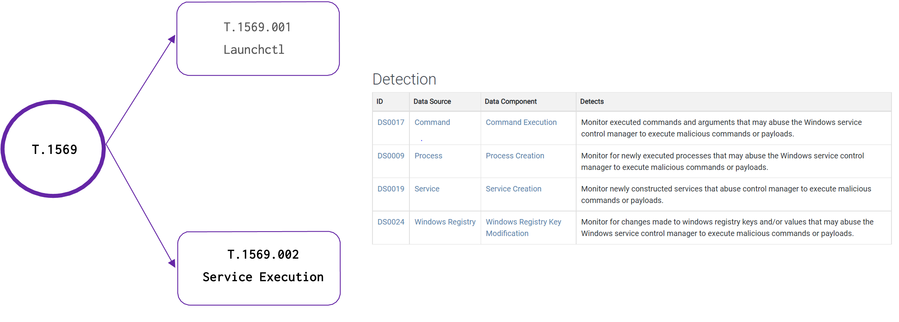{: width="70%"}
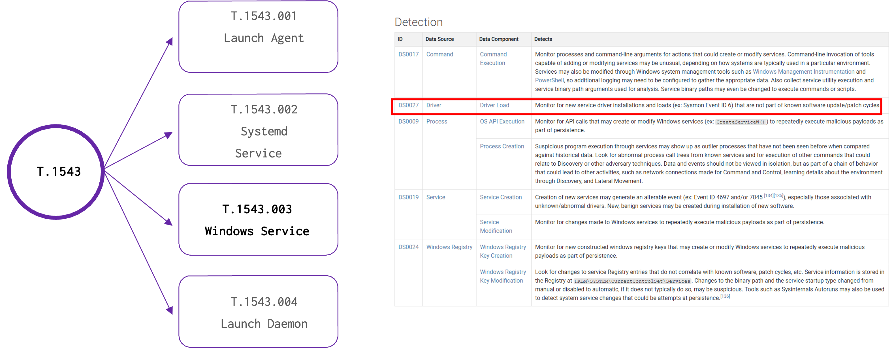{: width="70%"}
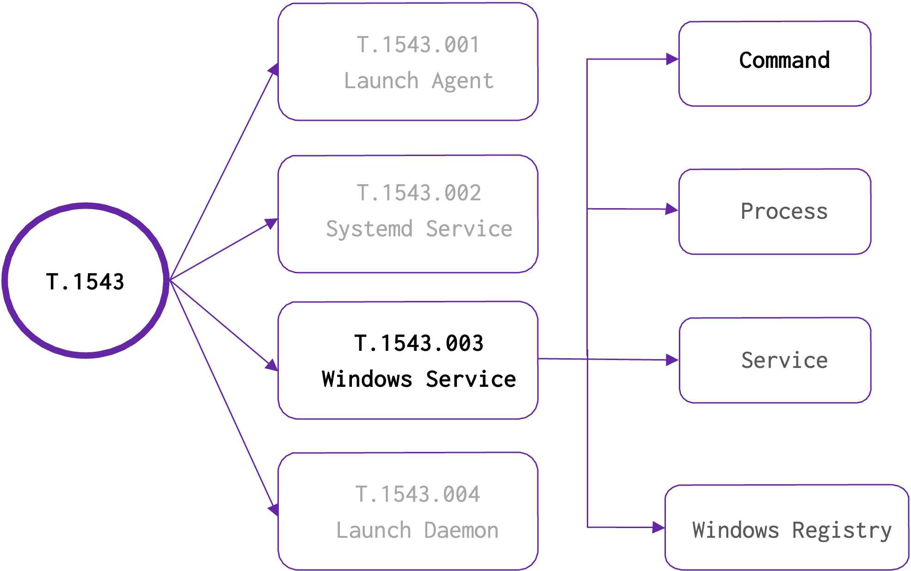{: width="40%"}
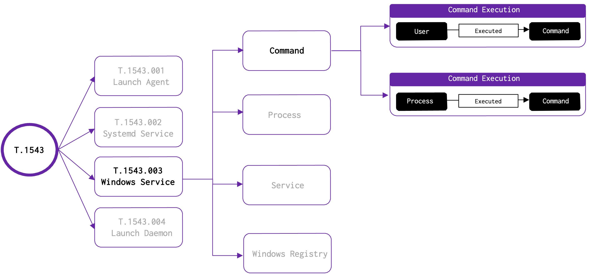{: width="70%"}
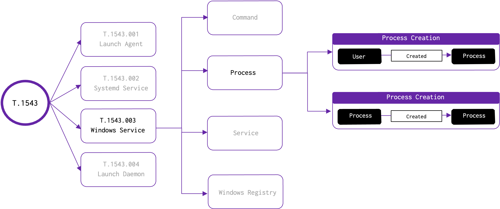{: width="70%"}
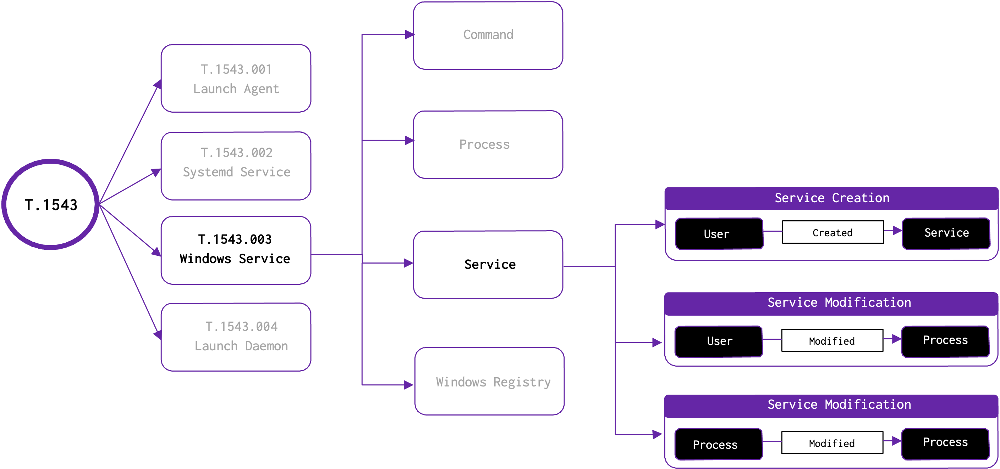{: width="70%"}
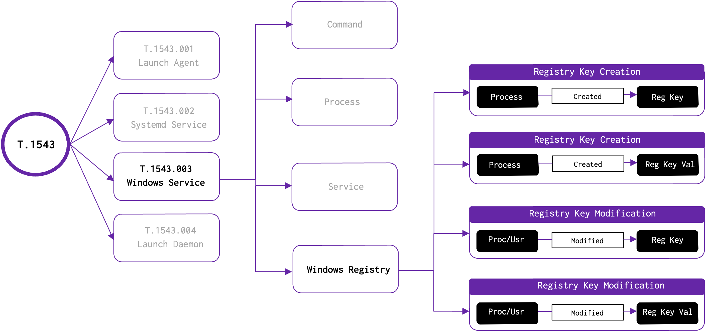{: width="70%"}
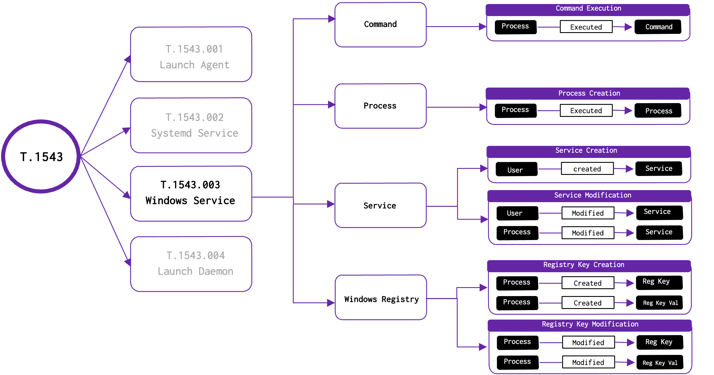{: width="70%"}
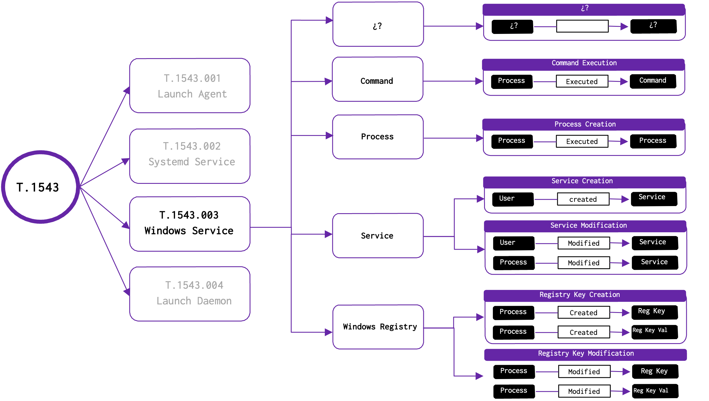{: width="70%"}
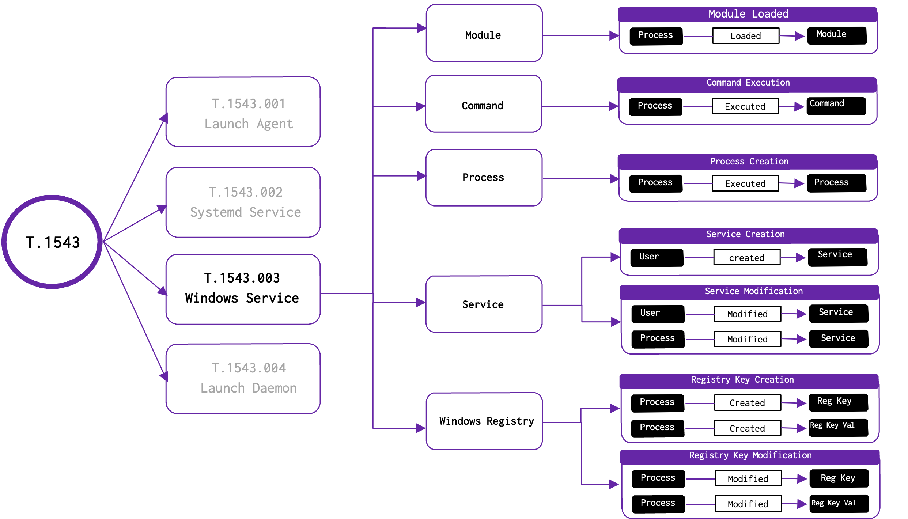{: width="70%"}
{: width="70%"}

### Construir la detección.

- Construir consultas con base en el modelo de datos de la detección.

| Entrada | Salida |
| --- | --- |
| Fuentes de datos deseadas. | Consulta/lógica para detectar el ataque en tu ambiente. |
| Pasos de validación. | Lista de todas las suposiciones que fueron hechas para la detección. |
| Entendimiento de la motivación del atacante. | Lista de falsos positivos. |

Una vez con el modelo de datos identificado, es momento de aplicarlo a una consulta, este modelo de datos incluye todas las oportunidades de detección de acuerdo a la investigación realizada sobre la técnica. 


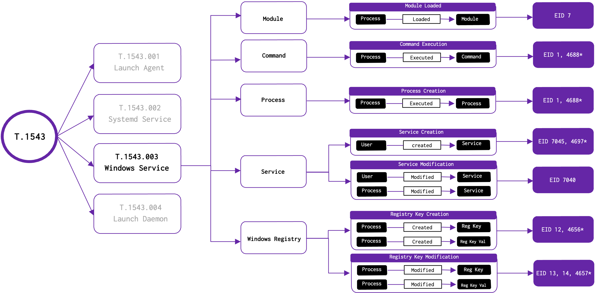{: width="70%"}

Como ejemplo se tomará el componente de _Command Execution_ perteneciente a la fuente de datos _Command_, combinando la investigación de la técnica y el modelado de datos es posible identificar los atributos que son estaticos y que permitiran reducir resultados no relevantes    

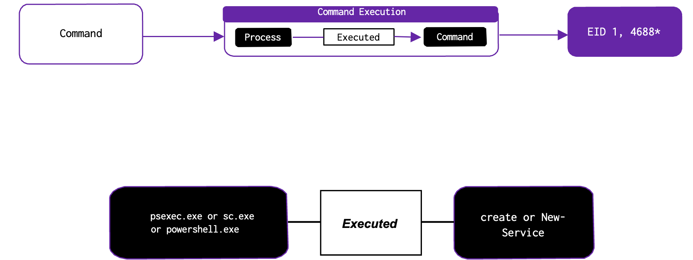{: width="70%"}

Posteriormente se define la consulta en lenguaje natural, esto permite tener una consulta no asociada a un lenguaje orientado a una tecnologia, sino agnostica, lista para ser traducida a pseudocodigo (Mitre CAR u OSSEM)  
#### Construyendo detecciones
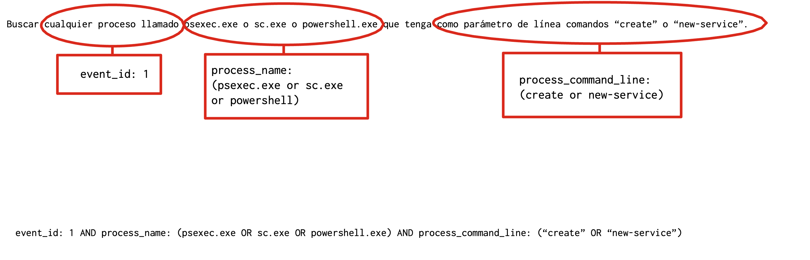{: width="70%"}

Finalmente, como se muestra en el ejemplo, se define la consulta de cada uno de los componentes de datos para cubrir todas las oportunidades de detección identificadas. En este momento también es posible identificar las suposiciones y puntos ciegos bajo los cuales estas consultas operarán.

## Conclusiones

- Conocer la importancia de contar con un entendimiento profundo del tradecraft empleado por los atacantes para detectar el uso de TTPs dentro del ambiente tecnológico que estemos defendiendo.

- Lograr familiaridad con conceptos clave para operacionalizar inteligencia provista por el Mitre ATT&CK, esto permite lograr un mayor entendimiento de como puede ser usada para madurar nuestras capacidades y estrategias de detección y respuesta. 

- Ingenieria de Detección y Threat Hunting son dos disciplinas intimamente relacionadas, conocer como influyen entre si nos ayuda a ser más efectivos en nuestros esfuerzos de identificación proactiva de amenazas. Threat Hunting e Ingenieria de Detección no se limitan al uso de herramientas, sino que emplean procesos iterativos, metódicos y analíticos.

- Mejorar el tradecraft del Blue Team permite cubrir esos “blind spots” que las amenazas buscan en las herramientas de detección.
